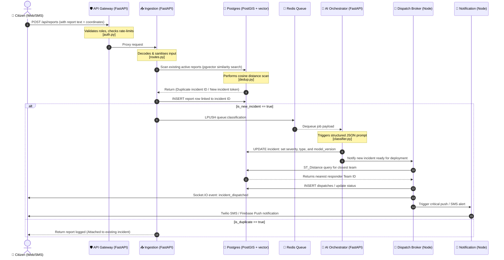

# 🚨 ResQNet — AI-Powered Disaster Intelligence Platform

ResQNet is a high-performance, real-time disaster coordination system. It ingests multi-modal emergency reports (text, voice, images, and IoT sensors), dedupes them using **pgvector** similarity matching, classifies them via an audited **LLM pipeline**, and dispatches nearest responders dynamically using **PostGIS** geography queries.


---

## 🧩 The Core Problem & Multilingual Solution

During high-stress disaster events, emergency response centers are overwhelmed by three critical bottlenecks:
1. **The Dialect & Language Barrier:** Citizens report local crises in their native tongues or regional dialects (e.g., Kannada, Hindi, Spanish), while dispatch operators or national rescue teams need standardized information to direct efforts.
2. **Channel Fragmentation:** Reports pour in through multiple mediums—ranging from web forms and mobile apps to legacy SMS, voice memos, and industrial IoT sensor triggers.
3. **Data Redundancy & Noise:** Hundreds of calls flood the switchboard for the same visual incident (e.g., a major bridge flooding), drowning out smaller, isolated life-safety reports.

### How ResQNet Solves It:
* **Real-time Voice/Text Translation:** ResQNet accepts voice reports directly. Audio is transcribed via a local whisper model, and the AI Orchestrator automatically detects the ISO-639-1 language code and translates the message.
* **Cross-Lingual Semantic Deduplication:** By mapping incident text to vector spaces with `pgvector`, reports submitted in different languages (e.g., a Kannada voice report and an English SMS) are identified as describing the same emergency. They are automatically grouped under a single parent Incident ID.
* **Localized Notification Feedback Loop:** The system keeps citizens informed in their original reporting language via SMS fallback channels, while authorities view clean, unified, and translated emergency entries on their command panels.

---

## 🛠️ Cluster Hub & Quick Nav

Choose a path below to test or configure ResQNet:

```
┌────────────────────────────────────────────────────────────────────────┐
│                        RESQNET INTERACTIVE CORE                        │
├───────────────┬─────────────────┬──────────────────┬───────────────────┤
│   🚀 JUDGE    │   🧪 LIFE-CYCLE  │   🏗️ SYSTEM       │   📦 LOCAL        │
│  QUICK START  │    SIMULATOR    │   PIPELINE       │  DEVELOPER SETUP  │
│  [Go ➔](#-role-playbooks--judge-dashboard-quick-start) │  [Go ➔](#-choose-your-own-adventure-scenario-simulator) | [Go ➔](#-system-architecture--interactive-flow) | [Go ➔](#-developer-installation-center) |
└───────────────┴─────────────────┴──────────────────┴───────────────────┘
```

### ⚡ Simulated System Health Check Status

| Service | Port | Endpoint | Health | Function |
| :--- | :---: | :--- | :---: | :--- |
| **API Gateway** | `8000` | [`/health`](http://localhost:8000/health) | `● ONLINE` | Reverse proxy, JWT role check, rate limiter |
| **Ingestion Engine** | `8001` | [`/health`](http://localhost:8001/health) | `● ONLINE` | Report intake, pgvector similarity deduplication |
| **AI Orchestrator** | `8002` | [`/health`](http://localhost:8002/health) | `● ONLINE` | Background LLM parsing, severity rating, classification |
| **Dispatch Broker** | `3001` | [`/health`](http://localhost:3001/health) | `● ONLINE` | Socket.IO event server, resource allocator, PostGIS query |
| **Notification Gateway** | `3002` | [`/health`](http://localhost:3002/health) | `● ONLINE` | SMS fallback delivery (Twilio), push alert broker |

---

## 🎮 Role Playbooks & Judge Dashboard Quick-Start

Expand the profiles below to explore ResQNet's interfaces. All preloaded accounts share the password: `password123`.

<details>
<summary><b>👤 CITIZEN PORTAL (SMS, Web & App Intake)</b></summary>
<br>

* **Dashboard Route:** `/citizen` (Login: `citizen@resqnet.org`)
* **Primary Objective:** Register reports, upload geo-tagged photo media, track incident resolution.
* **Under the Hood Code:** [`web/src/app/citizen/page.tsx`](./web/src/app/citizen/page.tsx)
* **Interactive Testing Action:**
  1. Login as `citizen@resqnet.org`.
  2. Click **Report Incident**. Type a simulation text: *"Water level rising rapidly over the bridge on Main St. Car is trapped with passengers!"*
  3. Upload any test image.
  4. Submit and observe the **Offline Sync Status** transition to **Synced** via the local state synchronization middleware.
  5. Copy the generated `Incident ID` to track its progress.

* **Trigger the Intake REST API manually:**
  ```bash
  curl -X POST http://localhost:8000/api/reports \
    -H "Content-Type: application/json" \
    -H "X-User-Id: 2c3d5e6f-7a8b-9c0d-1e2f-3a4b5c6d7e8f" \
    -H "X-User-Role: citizen" \
    -d '{
      "channel": "app",
      "raw_text": "Water level rising rapidly over the bridge on Main St. Car is trapped with passengers!",
      "location": {"longitude": 77.5946, "latitude": 12.9716},
      "sync_status": "synced"
    }'
  ```
</details>

<details>
<summary><b>🤝 VOLUNTEER NETWORK (Location & Skill matching)</b></summary>
<br>

* **Dashboard Route:** `/volunteer` (Login: `volunteer@resqnet.org`)
* **Primary Objective:** Toggle availability, update specialized skills (e.g. *First Aid*, *Water Rescue*), view current incident task request alerts.
* **Under the Hood Code:** [`web/src/app/volunteer/page.tsx`](./web/src/app/volunteer/page.tsx)
* **Interactive Testing Action:**
  1. Login as `volunteer@resqnet.org`.
  2. Go to the profile page and add the **Water Rescue** skill.
  3. Toggle status slider to **Available**.
  4. Watch tasks populate in your live grid based on matching location algorithms.
</details>

<details>
<summary><b>🚒 RESCUE TEAM DISPATCH (Real-time Responders)</b></summary>
<br>

* **Dashboard Route:** `/rescue` (Login: `rescue@resqnet.org`)
* **Primary Objective:** Accept live dispatches, access turn-by-turn routing via Mapbox, log status reports from the scene, and close cases.
* **Under the Hood Code:** [`web/src/app/rescue/page.tsx`](./web/src/app/rescue/page.tsx)
* **Interactive Testing Action:**
  1. Log into `/login` with credentials `rescue@resqnet.org`.
  2. Keep this tab open next to the Citizen portal.
  3. File a new incident report on the Citizen portal and watch the active list update **instantly** without reloading via the Socket.IO adapter broker.
</details>

<details>
<summary><b>🛡️ AUTHORITY CONTROL CENTER (Emergency Command)</b></summary>
<br>

* **Dashboard Route:** `/authority` (Login: `authority@resqnet.org`)
* **Primary Objective:** Set emergency overrides on severities, monitor resources, and broadcast district-wide emergency alert overrides.
* **Under the Hood Code:** [`web/src/app/authority/page.tsx`](./web/src/app/authority/page.tsx)
* **Interactive Testing Action:**
  1. Login as `authority@resqnet.org`.
  2. Find an incident classified as "Moderate" by the AI.
  3. Click **Override Severity** to upgrade it to **Critical** (This records your Authority UID and override justification in the database log for audit transparency).
  4. Navigate to **Broadcast Alert** to blast a severe advisory notification to all registered numbers in the matching PostGIS district.
</details>

<details>
<summary><b>💻 SYSTEM ADMIN AUDIT (Telemetry & Config)</b></summary>
<br>

* **Dashboard Route:** `/admin` (Login: `admin@resqnet.org`)
* **Primary Objective:** Telemetry audit reviews, DB size statistics, and LLM model switching configuration.
* **Under the Hood Code:** [`web/src/app/admin/page.tsx`](./web/src/app/admin/page.tsx)
* **Interactive Testing Action:**
  1. Login as `admin@resqnet.org`.
  2. View the system-wide security log detailing all model versions used for classifications.
</details>

---

## 🧪 Choose-Your-Own-Adventure Scenario Simulator

Pick a disaster scenario below to simulate the backend execution pipeline (Ingestion ➔ pgvector Check ➔ LLM Parse ➔ PostGIS Routing ➔ Socket Broadcast):

<details>
<summary><b>🌊 Scenario A: Flash Flooding (Heavy Rain & Trapped Cars)</b></summary>
<br>

#### 1. Ingestion Request
The Citizen client submits the raw report payload:
```json
{
  "channel": "app",
  "raw_text": "Flooding on Main St! The water is up to car doors and 3 people are stuck inside a silver sedan.",
  "location": {"longitude": 77.5946, "latitude": 12.9716}
}
```

#### 2. Similarity Check (pgvector)
The database scans existing active incidents using cosine distance search:
```sql
SELECT id, status, location <-> ST_SetSRID(ST_MakePoint(77.5946, 12.9716), 4326) AS dist 
FROM incidents 
WHERE description_embedding <=> :embedding < 0.08; -- Cosine Similarity > 92%
```
* **Engine Result:** `0 matches found`. This is flagged as a **New Unique Incident** (Assigned `INCIDENT_ID: 9b1deb4d-3b7d`).

#### 3. LLM Orchestration
The ingestion worker enqueues the incident to Redis. The AI Orchestrator dequeues it and evaluates:
```json
{
  "incident_type": "flood",
  "severity_score_raw": 0.88,
  "reasoning": "High water levels posing immediate threat to passengers trapped inside a vehicle.",
  "language_detected": "en"
}
```
* **Calculated Tier:** `SeverityTier.critical` (Score 0.88 is in range 0.85-1.0).
* **Audit Record Written:** `gpt-4o-mini@xyz890` saved in [`classifications`](./db/migrations/002_core_schema.sql) table.

#### 4. PostGIS Dispatch Matching
The system queries the database for the closest available rescue team:
```sql
SELECT id, name, ST_Distance(home_district::geography, ST_SetSRID(ST_MakePoint(77.5946, 12.9716), 4326)) AS distance
FROM teams
WHERE current_status = 'available'
ORDER BY distance LIMIT 1;
```
* **Matched Responder:** `Emergency Team Beta` (Dispatched automatically).

#### 5. Real-Time Socket Event Emit
```json
{
  "event": "incident_dispatched",
  "room": "district_bangalore",
  "payload": {
    "incident_id": "9b1deb4d-3b7d",
    "type": "flood",
    "severity": "critical",
    "coordinates": [77.5946, 12.9716],
    "assigned_team": "Emergency Team Beta"
  }
}
```
</details>

<details>
<summary><b>🏢 Scenario B: Structural Incident (Earthquake / Crack Warning)</b></summary>
<br>

#### 1. Ingestion Request
The Citizen client submits a local report:
```json
{
  "channel": "sms",
  "raw_text": "Huge cracks just appeared in the main support beam of the metro station near Central Market.",
  "location": {"longitude": 77.6012, "latitude": 12.9804}
}
```

#### 2. Similarity Check (pgvector)
* **Engine Result:** Matches index with cosine distance `0.06` (Similarity 94%) to an incident reported 4 minutes ago (*"Structural concrete fracturing near station entrance"*).
* **Deduplication Action:** `is_duplicate = true`. Report is attached to existing `INCIDENT_ID: 1a2b3c4d-5e6f` instead of spawning a new incident. This prevents command clutter.
</details>

<details>
<summary><b>☣️ Scenario C: IoT Chemical Leak (Gas Sensor Trigger)</b></summary>
<br>

#### 1. Ingestion Request
An industrial air sensor posts a telemetry packet:
```json
{
  "channel": "iot_sensor",
  "raw_text": "SENSOR_ALERT: NH3 level exceeds 50ppm warning limit.",
  "location": {"longitude": 77.6534, "latitude": 12.9212}
}
```

#### 2. LLM Orchestration
The AI engine interprets the chemical name and ppm data:
```json
{
  "incident_type": "chemical_gas_leak",
  "severity_score_raw": 0.95,
  "reasoning": "Toxic Ammonia gas sensor reading is at hazardous concentration levels.",
  "language_detected": "en"
}
```
* **Calculated Tier:** `SeverityTier.critical`
* **Real-time Dispatch Action:** Fires critical event triggers that ping Hazardous Materials (HazMat) rescue response squads instantly.
</details>

---

## 🏗️ System Architecture & Interactive Flow

Below is the execution flow of an incoming emergency report passing through the microservice cluster. Hover and click on steps to link to their code:



### 🔗 Code File Shortcuts

Explore the underlying components directly:

* **Gateway Router & Auth Guards:** [`services/api-gateway/auth.py`](./services/api-gateway/auth.py)
* **Similarity & Vector Scoring:** [`services/ingestion/dedup.py`](./services/ingestion/dedup.py)
* **Ingestion Route Definitions:** [`services/ingestion/routes.py`](./services/ingestion/routes.py)
* **LLM Prompts & Parser:** [`services/ai-orchestration/classifier.py`](./services/ai-orchestration/classifier.py)
* **PostGIS Geographic Dispatch:** [`services/dispatch-resource/src/matching.ts`](./services/dispatch-resource/src/matching.ts)
* **Socket Room Dispatch:** [`services/dispatch-resource/src/socket/rooms.ts`](./services/dispatch-resource/src/socket/rooms.ts)
* **SMS & Push Deliveries:** [`services/notification/src/`](./services/notification/)

---

## 🗂️ Clickable Workspace Explorer

Click a folder or schema to open the repository code directories:

* 📂 [**`db/`**](./db) — Database Migrations and Seed SQL Scripts
  * 📄 [`001_extensions.sql`](./db/migrations/001_extensions.sql) — PostGIS & pgvector installation
  * 📄 [`002_core_schema.sql`](./db/migrations/002_core_schema.sql) — Core relational entities
  * 📄 [`003_indexes.sql`](./db/migrations/003_indexes.sql) — Spatial and similarity indices
  * 📄 [`dev_seed.sql`](./db/seed/dev_seed.sql) — Demo users & mock incidents
* 📂 [**`services/`**](./services) — Service Clusters
  * 📂 [**`api-gateway/`**](./services/api-gateway) — FastAPI authentication router and gateway
  * 📂 [**`ingestion/`**](./services/ingestion) — Core ingestion logic, media upload, and dedup
  * 📂 [**`ai-orchestration/`**](./services/ai-orchestration) — LLM processor, classifier, and worker queues
  * 📂 [**`dispatch-resource/`**](./services/dispatch-resource) — Socket.IO matching engine and route solver
  * 📂 [**`notification/`**](./services/notification) — Twilio/Firebase SMS and push alerts
* 📂 [**`web/`**](./web) — Next.js 16 Client Portal UI (Citizen, Volunteer, Authority dashboards)
* 📂 [**`docs/`**](./docs) — Security compliance and hardening specifications

---

## 📦 Developer Installation Center

Choose your setup workflow below to spin up ResQNet locally:

<details>
<summary><b>🐳 Workflow 1: Docker Compose (Quickest Setup)</b></summary>
<br>

Ensure you have Docker Desktop installed, then run:

```bash
# 1. Initialize environment variables
cp infra/.env.example infra/.env

# 2. Open infra/.env and fill in your keys:
#    JWT_SECRET=use-openssl-rand-to-generate-key
#    LLM_API_KEY=your-openai-or-groq-key

# 3. Spin up the entire microservice architecture
cd infra
docker-compose up --build
```
This builds and starts: PostgreSQL (with PostGIS/pgvector), Redis, API Gateway, Ingestion, AI Orchestration, Dispatch, and Notification services.
</details>

<details>
<summary><b>💻 Workflow 2: Native Manual Setup (Debugging & Local Edits)</b></summary>
<br>

#### 1. Start the Database & Redis
Ensure PostgreSQL and Redis are running on your machine:
```bash
# Start Docker containers for DB & Redis only
docker run -d --name resqnet-db -p 5432:5432 -e POSTGRES_PASSWORD=password postgis/postgis
docker run -d --name resqnet-redis -p 6379:6379 redis:alpine
```

#### 2. Run Database Migrations
```bash
# Apply SQL files in sequence
psql -h localhost -U postgres -d postgres -f db/migrations/001_extensions.sql
psql -h localhost -U postgres -d postgres -f db/migrations/002_core_schema.sql
psql -h localhost -U postgres -d postgres -f db/migrations/003_indexes.sql
psql -h localhost -U postgres -d postgres -f db/migrations/004_auth_and_admin.sql
psql -h localhost -U postgres -d postgres -f db/seed/dev_seed.sql
```

#### 3. Spin Up Services
Open separate terminals to execute the microservices:

* **API Gateway (8000):**
  ```bash
  cd services/api-gateway
  python -m venv venv && source venv/bin/activate
  pip install -r requirements.txt
  uvicorn main:app --reload --port 8000
  ```
* **Ingestion (8001):**
  ```bash
  cd services/ingestion
  python -m venv venv && source venv/bin/activate
  pip install -r requirements.txt
  uvicorn main:app --reload --port 8001
  ```
* **AI Orchestration (8002):**
  ```bash
  cd services/ai-orchestration
  python -m venv venv && source venv/bin/activate
  pip install -r requirements.txt
  python worker.py
  ```
* **Dispatch Server (3001):**
  ```bash
  cd services/dispatch-resource
  npm install
  npm run dev
  ```
* **Web UI (3000):**
  ```bash
  cd web
  cp .env.example .env.local
  npm install
  npm run dev
  ```
</details>

---

## 🔮 Diagnostic & Troubleshooting Wizard

If you run into issues, expand the common problems below for immediate diagnostics:

<details>
<summary><b>❌ Issue 1: Database Seed Failures or Missing PG Extensions</b></summary>
<br>

* **Symptom:** Logs show `relation "incidents" does not exist` or `type "vector" does not exist`.
* **Reason:** Database migrations did not run in order, or the PostgreSQL image lacks PostGIS/pgvector extensions.
* **Fix:** Ensure you are using the official PostGIS/pgvector container:
  ```bash
  # Check if container is running:
  docker ps | grep postgis
  
  # Re-run migrations explicitly:
  docker exec -i resqnet-db-1 psql -U postgres -d resqnet < db/migrations/001_extensions.sql
  docker exec -i resqnet-db-1 psql -U postgres -d resqnet < db/migrations/002_core_schema.sql
  ```
</details>

<details>
<summary><b>❌ Issue 2: Socket.IO Connection Errors in the Console</b></summary>
<br>

* **Symptom:** Next.js console reports `WebSocket connection to 'ws://localhost:3001/' failed`.
* **Reason:** Redis is down, or the Node dispatch server is not communicating over the shared network.
* **Fix:** 
  1. Verify Redis is running: `docker exec -it resqnet-redis-1 redis-cli ping` (should output `PONG`).
  2. Verify Node backend health: `curl http://localhost:3001/health`.
</details>

<details>
<summary><b>❌ Issue 3: Classification Model Returning Unknown or Empty Values</b></summary>
<br>

* **Symptom:** Incidents remain in `reported` state and classification results default to `unknown` or `stub`.
* **Reason:** The `LLM_API_KEY` in `infra/.env` is missing or invalid, causing the worker to fall back to dev-stub mode.
* **Fix:** Check your environment settings:
  ```bash
  # Check if variable is exposed inside the docker container:
  docker exec -it resqnet-ai-orchestration-1 env | grep LLM_API_KEY
  ```
  Ensure your key is set, and restart the orchestrator: `docker-compose restart ai-orchestration`.
</details>
